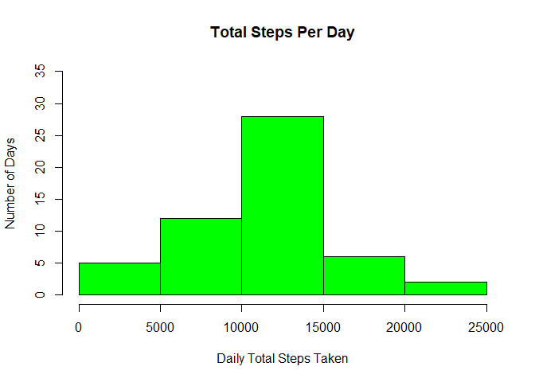
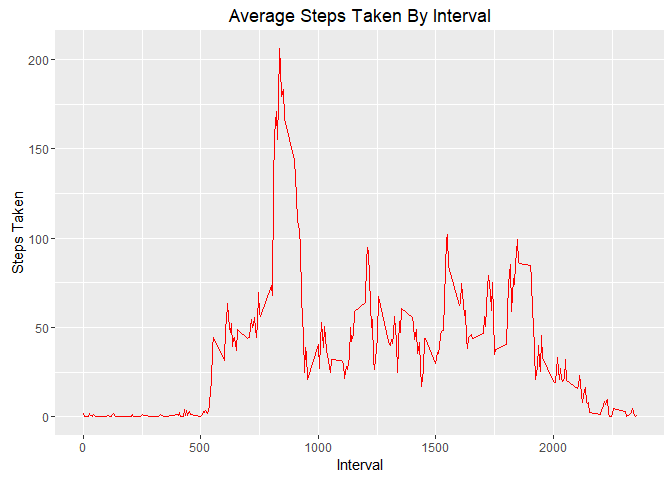
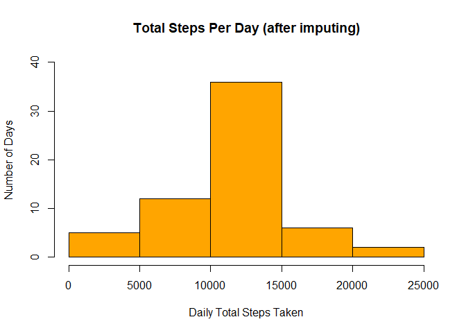
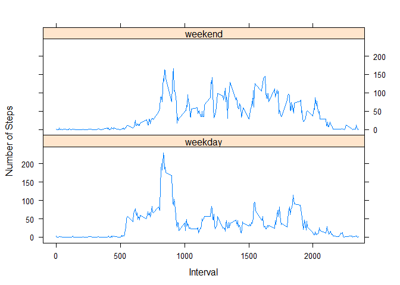

# Reproducible Research: Peer Assessment 1

## Loading and preprocessing the data

```r
##################################
#Initialize
##################################

library(ggplot2)

library(dplyr)

##################################
#Load Data
##################################

activity_data <- read.csv(unz("activity.zip","activity.csv"), header=TRUE, na.strings="NA", sep=",", quote="\"")

valid_data <- activity_data[!is.na(activity_data$steps),]
```
   

## What is mean total number of steps taken per day?


```r
##################################
#Calculate Total Steps Per Day
##################################

total_steps_by_date <- aggregate(data=valid_data,steps~date,sum)

##################################
#Histogram Of Total Steps Per Day
##################################

hist(total_steps_by_date$steps, 
     main="Total Steps Per Day", 
     xlab="Daily Total Steps Taken", 
     ylab="Number of Days", 
     col="green",
     ylim=range(0:35))
```

<!-- -->


```r
##################################
#Calculate Mean Steps Per Day
##################################

mn <- round(mean(total_steps_by_date$steps),digits=2)
```

#####**The MEAN total steps per day is: 10766.19** 


```r
##################################
#Calculate Median Steps Per Day
##################################

md <- round(median(total_steps_by_date$steps),digits=2)
```

#####**The MEDIAN total steps per day is: 10765**  

## What is the average daily activity pattern?


```r
##################################
#Calculate Mean Steps By Interval
##################################

average_steps_by_interval <- aggregate(data=valid_data,steps~interval,mean)

##################################
#Plot Mean Steps By Interval
##################################

ggplot(average_steps_by_interval, aes(x=interval, y=steps)) +
  geom_line(color="red") +
  xlab("Interval") +
  ylab("Steps Taken") +
  ggtitle("Average Steps Taken By Interval")
```

<!-- -->


```r
##################################
#Interval With Max Mean Steps
##################################

max_average_steps_interval <- average_steps_by_interval[average_steps_by_interval$steps==max(average_steps_by_interval$steps),]
```

#####**The MAX average steps per day was 206.17 and occurred in interval 835**.  

## Imputing missing values


```r
##################################
#Count of Days with No Data
##################################

invalid_data <- activity_data[is.na(activity_data$steps),]

cnt_invalid_data <- count(invalid_data)
```

#####**There are 2304 missing values in the dataset.**  


```r
##################################
#Create Data with Imputed Values
##################################

fixed_data <- tbl_df(activity_data)

fixed_data <- inner_join(fixed_data, average_steps_by_interval, by = "interval")

names(fixed_data) <- c("steps","date","interval","avg")

fixed_data$steps <- ifelse(is.na(fixed_data$steps), fixed_data$avg, fixed_data$steps)

fixed_data <- fixed_data[1:3]
```


```r
##################################
#Calculate Total Steps Per Day (after imputing)
##################################

total_steps_by_date_imputed <- aggregate(data=fixed_data,steps~date,sum)

##################################
#Histogram Of Total Steps Per Day (after imputing)
##################################

hist(total_steps_by_date_imputed$steps, 
     main="Total Steps Per Day (after imputing)", 
     xlab="Daily Total Steps Taken", 
     ylab="Number of Days", 
     col="orange",
     ylim=range(0:40))
```

<!-- -->


```r
##################################
#Calculate Mean Steps Per Day (after imputing)
##################################

mn_i <- round(mean(total_steps_by_date_imputed$steps),digits=2)
```

#####**The MEAN total steps per day (after imputing) is: 10766.19** 


```r
##################################
#Calculate Median Steps Per Day (after imputing)
##################################

md_i <- round(median(total_steps_by_date_imputed$steps),digits=2)
```

#####**The MEDIAN total steps per day (after imputing) is: 10766.19**  

#####**Imputing the missing values did not affect the MEAN. However, the MEDIAN was affected.**  

## Are there differences in activity patterns between weekdays and weekends?


```r
##################################
#Set Day of Week Category Factor
##################################

fixed_data <- data.frame(fixed_data, dow = weekdays(as.Date(fixed_data$date)))

fixed_data <- mutate(fixed_data, dow_cat = ifelse(fixed_data$dow %in% c("Sunday","Saturday"), "weekend","weekday"))

fixed_data$dow_cat <- as.factor(fixed_data$dow_cat)

fixed_data$interval <- as.factor(fixed_data$interval)
```


```r
##################################
#Calculate Mean Steps By Weekday Type & Interval 
##################################

average_steps_by_dow_cat_interval <- aggregate(data=fixed_data,steps~dow_cat+interval,mean)

average_steps_by_dow_cat_interval$interval <- as.character(average_steps_by_dow_cat_interval$interval)

##################################
#Plot Mean Steps By Interval By Day Category
##################################

xyplot(steps~interval|factor(dow_cat),
       data = average_steps_by_dow_cat_interval,
       type='l',
       layout=c(1,2),
       xlab='Interval',
       ylab='Number of Steps',
       xlim=seq(-100,2500,500))
```

<!-- -->
